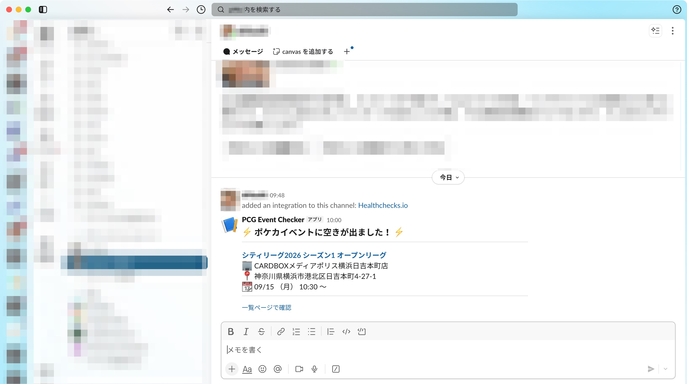
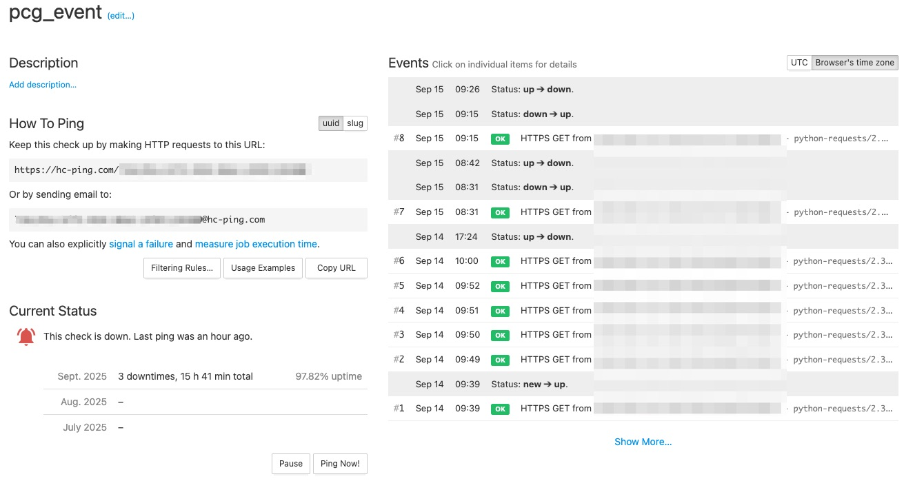
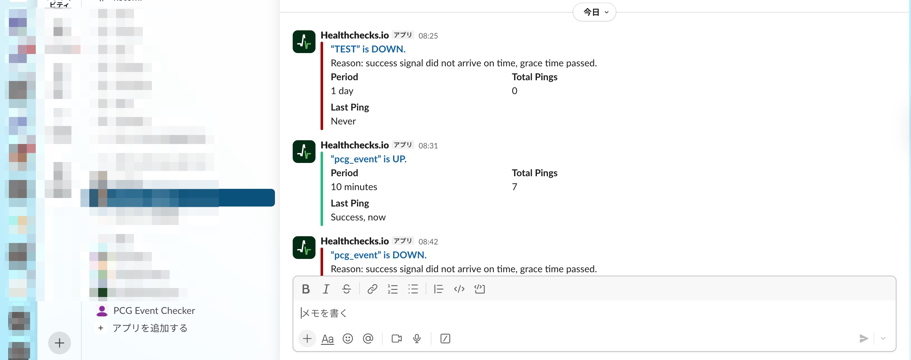

# ポケモンカードゲーム イベント監視スクリプト (Pokémon Trading Card Game Event Monitor)

指定された[ポケモンカードゲーム トレーナーズウェブサイトのイベント検索ページ](https://players.pokemon-card.com/event/search)を定期的に監視し、新たなイベント（キャンセルによる空きを含む）が追加された際にSlackへ通知を送信するPythonスクリプトです。

## ✨ 主な機能

- **動的ページ対応:** JavaScriptで描画されるWebサイトに対応するため、Playwrightを使用してブラウザを自動操作します。
- **リッチなSlack通知:** SlackのBlock Kitを利用し、イベント名、店舗、場所、日時、URLなどを見やすく整形して通知します。
- **堅牢な永続化:** 通知済みのイベントをSQLiteデータベースに保存し、スクリプトの再起動後も重複した通知を防ぎます。
- **安全な設定管理:** `config.json`ファイルで設定を管理し、SlackのWebhook URLなどの秘密情報をコードから分離します。
- **死活監視 (ハートビート):** Healthchecks.io などの外部サービスと連携し、スクリプトが正常に動作しているかを監視します。
- **高度なエラーハンドリング:** ページ取得の失敗や解析エラーを検知し、詳細なエラー内容をSlackへアラートとして通知します。
- **サーバーへの配慮:** アクセス間隔に調整し、サーバー負荷を軽減します。またアクセス間隔にランダムな「ゆらぎ（ジッター）」を持たせます。
- **詳細なロギング:** `logging`モジュールを使用し、日次でローテーションされるログファイルに全活動を記録します。
- **高機能なデバッグモード:** 本番とは分離された環境で、正常系・異常系の両方の動作を安全かつ効率的にテストできます。

図1. slack通知


図2. ハートビート監視の画面


図3. ハートビート監視のslack通知


## ⚙️ 動作要件

- Python 3.9 以上

## 🚀 セットアップ手順

1.  **リポジトリをクローン**
    ```bash
    git clone https://github.com/marcharunr/pcg_event.git
    cd pcg_event
    ```

2.  **Python仮想環境の作成と有効化**
    ```bash
    python -m venv .venv
    source .venv/bin/activate
    # Windowsの場合は .\.venv\Scripts\activate
    # fishシェルの場合は source .venv/bin/activate.fish
    ```

3.  **依存パッケージのインストール**
    ```bash
    pip install -r requirements.txt
    ```

4.  **Playwrightのブラウザエンジンをインストール**
    ```bash
    playwright install
    ```

5.  **設定ファイルの作成**
    `config.json.example`をコピーして`config.json`を作成します。
    ```bash
    cp config.json.example config.json
    ```
    その後、`config.json`を開き、 `TARGET_URL`を指定してください。このURLは[ポケモンカードゲーム トレーナーズウェブサイトのイベント検索ページ](https://players.pokemon-card.com/event/search)で、希望の条件で検索した際に表示されるURLです。
    
    次に、Slackの通知を受けるために`SLACK_WEBHOOK_URL`を正しい値に書き換えてください。まず、ご自身で管理されている Slack Workspace の [Slack App](https://api.slack.com/apps) のページにアクセスします。次に、Slack App を作成し、`Incoming Webhooks` をONにします。最後に`Webhook URL`からURLをコピーして`SLACK_WEBHOOK_URL`の値を書き換えてください。

6.  **(任意) 死活監視の設定**
    スクリプトが停止していないかを監視するために、Healthchecks.io のようなハートビート監視サービスを利用することを推奨します。現在、[healthchecks.ioh](ttps://healthchecks.io/)でのみ動作確認しています。
    1.  サービスに登録し、新しいチェックを作成してPing URLを取得します。
    2.  `config.json` を開き、`HEALTHCHECKS_URL` に取得したURLを設定します。
    ```json
    "HEALTHCHECKS_URL": "https://hc-ping.com/your-uuid"
    ```

## 🏃‍ 実行方法

### デバッグモードでの実行

スクリプトの動作や通知のテストを行うには、`config.json`の`"DEBUG_MODE"`を`true`に設定します。

まず、`config.json` に `TARGET_URL` が正しく設定されていることを確認してください。`make_mock.sh` はこのURLを使ってテスト用のHTMLを生成します。

まず、テスト用のモックHTMLファイルを作成します。
```bash
chmod +x make_mock.sh
sh make_mock.sh
```

その後、スクリプトを実行します。
```bash
python event_checker.py
```
これにより、実際のWebサイトにはアクセスせず、ローカルのHTMLファイルを使って安全にテストが実行されます。

### 本番モードでの実行

実際に監視を開始するには、`config.json`の`"DEBUG_MODE"`を`false`に設定して、スクリプトを実行します。

```bash
python event_checker.py
```

スクリプトをバックグラウンドで永続的に実行したい場合は、`nohup`や`systemd`、`supervisor`、`launchd`などのツールを使用することを推奨します。

#### 例1: nohupによるバックグラウンド実行

```bash
nohup python event_checker.py > /dev/null 2>&1 &
```

#### 例2:macOSでの自動起動・再起動 (launchd)

macOSでスクリプトを永続的に実行するには、`launchd`を利用するのが最も堅牢です。User Agentとして起動する方法を以下で解説します。User Agentでの起動は実行ユーザーがログインしたときに起動し、ユーザー権限で起動されることに注意してください。

1.  `deployment/com.user.pcg-event-monitor.plist.example` を `deployment/com.user.pcg-event-monitor.plist` としてコピーします。
2.  コピーしたファイルを開き、`__PYTHON_EXECUTABLE_PATH__`, `__SCRIPT_PATH__`, `__WORKING_DIRECTORY__` の3つのプレースホルダーを、あなたの環境の絶対パスに書き換えます。
    -   `__PYTHON_EXECUTABLE_PATH__` は、仮想環境を有効化した状態で `which python` コマンドを実行すると確認できます。
    ```bash
    # 仮想環境を有効化
    source .venv/bin/activate
    # Pythonの絶対パスを表示
    which python
    ```
3.  ターミナルで以下のコマンドを実行し、`deployment`ディレクトリに移動してから、`launchd`にサービスを登録・起動します。
    ```bash
    # (注意) 以下の設定ではログが/dev/nullに捨てられます。
    # トラブルシューティングのためにログを残したい場合は、
    # .plistファイル内のStandardOutPathとStandardErrorPathを
    # ログファイル（例: /Users/your_name/Projects/pcg_event/logs/output.log）に変更してください。
    cd deployment/
    launchctl load com.user.pcg-event-monitor.plist
    ```
4.  サービスを停止・登録解除する場合は、以下のコマンドを実行します。
    ```bash
    launchctl unload com.user.pcg-event-monitor.plist
    ```

#### 例3: macOSサーバーでの永続実行 (System Daemon)

ユーザーがログアウトしてもスクリプトを実行し続けたい場合は、User Agentの代わりに**System Daemon**として登録するのが最適です。System Daemonはシステムの起動時に開始され、特定のユーザーに依存しませんが、`UserName`キーを使うことでユーザー権限やスコープで実行できます。

**主な利点:**
-   Macの起動と同時に自動で実行開始します。
-   ユーザーがログアウトしても、スクリプトはバックグラウンドで動作し続けます。
-   `root`権限ではなく、指定したユーザーの権限で安全に実行できます。

**手順:**

1.  System Daemon用の設定ファイル例 `deployment/com.user.pcg-event-monitor.daemon.plist.example` をコピーして、実際に使用する設定ファイルを作成します。
    ```bash
    cp deployment/com.user.pcg-event-monitor.daemon.plist.example deployment/com.user.pcg-event-monitor.daemon.plist
    ```

2.  コピーした `com.user.pcg-event-monitor.daemon.plist` を開き、`__YOUR_USERNAME__`, `__PYTHON_EXECUTABLE_PATH__`, `__SCRIPT_PATH__`, `__WORKING_DIRECTORY__` の4つのプレースホルダーを、あなたの環境の実際の値に書き換えます。
    -   `__YOUR_USERNAME__` はあなたのmacOSのユーザー名です（例: `pokemon`）。
    -   `__PYTHON_EXECUTABLE_PATH__` は、仮想環境を有効化した状態で `which python` コマンドを実行すると確認できます。
    ```bash
    # 仮想環境を有効化
    source .venv/bin/activate
    # Pythonの絶対パスを表示
    which python
    ```

3.  プロジェクトルートにログ用のディレクトリを作成します。
    ```bash
    mkdir -p logs
    ```

4.  作成した `.plist` ファイルをシステムディレクトリにコピーし、適切な権限を設定します。
    ```bash
    # ファイルを /Library/LaunchDaemons/ にコピー
    sudo cp deployment/com.user.pcg-event-monitor.daemon.plist /Library/LaunchDaemons/

    # ファイルの所有者を root:wheel に変更
    sudo chown root:wheel /Library/LaunchDaemons/com.user.pcg-event-monitor.daemon.plist

    # ファイルのパーミッションを 644 に変更
    sudo chmod 644 /Library/LaunchDaemons/com.user.pcg-event-monitor.daemon.plist
    ```

5.  `launchd`にSystem Daemonとしてサービスを登録・起動します。
    ```bash
    sudo launchctl load -w /Library/LaunchDaemons/com.user.pcg-event-monitor.daemon.plist
    ```
    `-w` オプションは、サービスが無効化されていても強制的に有効化してロードします。

6.  サービスを停止・登録解除する場合は、以下のコマンドを実行します。
    ```bash
    sudo launchctl unload -w /Library/LaunchDaemons/com.user.pcg-event-monitor.daemon.plist
    ```

## 🔧 設定項目 (`config.json`)

- `SLACK_WEBHOOK_URL`: (必須) 通知を送信するSlackのIncoming Webhook URL。
- `TARGET_URL`: (必須) 監視対象のイベント検索ページのURL。
- `MIN_INTERVAL_SECONDS`: 最小チェック間隔（秒）。
- `MAX_INTERVAL_SECONDS`: 最大チェック間隔（秒）。この範囲でランダムに待機します。
- `SLACK_MENTION`: (任意) 通知時に追加するメンション。例: `@channel`, `@here`, `@U12345678` など。
- `HEALTHCHECKS_URL`: (任意) Healthchecks.io などの死活監視サービスから取得したPing URL。
- `DEBUG_MODE`: `true`にするとデバッグモードで実行します。
- `INJECT_PAGE_ERROR`: (デバッグ用) `true`にすると、意図的にページ取得エラーを発生させ、エラー通知をテストします。
- `INJECT_PARSE_ERROR`: (デバッグ用) `true`にすると、意図的に解析エラーを発生させ、エラー通知をテストします。

## 🛠️ 補助スクリプト

### `capture_html.py`

指定したURLのレンダリング済みHTMLをファイルに保存します。デバッグ用のモックファイルを作成・更新する際に使用します。

**使い方:**
```bash
python capture_html.py <URL> <出力ファイル名.html>
```

## 制限
- **ページネーション非対応:** たくさんのイベントが検索されてページネーションが発生する場合は最初のページのみをみています。このシステムは、もともとシティリーグの枠がすぐに埋まってしまう地方のイベントのキャンセル枠を拾うことを想定した実験として作られました。そのため、たくさんのイベントが発生しないという前提で実装されています。新規シーズンで大量にイベントが登録されたタイミングは監視の必要性が少ないため、このような実装になっています。
- **限られた投稿先:** イベント情報の投稿先は現在のところSlackのみに対応しています。X, Lineは投稿のAPIでの制限が厳しいため、現在のところ対応していません。

## 📜 ライセンス

このプロジェクトは MIT License のもとで公開されています。

## ⚠️ 免責事項

本ソフトウェアは、技術的な学習および実験を目的として作成されたものです。

本ソフトウェアの利用により、対象ウェブサイトの利用規約に違反する可能性があります。利用者は、自身の責任において本ソフトウェアを使用するものとし、本ソフトウェアの利用によって生じたいかなる損害や問題についても、作成者は一切の責任を負いません。

対象ウェブサイトの利用規約を十分に確認し、遵守してください。

## 商標について

本プロジェクト内で言及されている「ポケモン」、「ポケモンカードゲーム」、「Pokémon Trading Card Game」その他の関連する名称は、任天堂、クリーチャーズ、ゲームフリーク、株式会社ポケモンの登録商標または商標です。

本プロジェクトは、これらの企業とは一切関係がなく、公式に承認または後援されているものではありません。